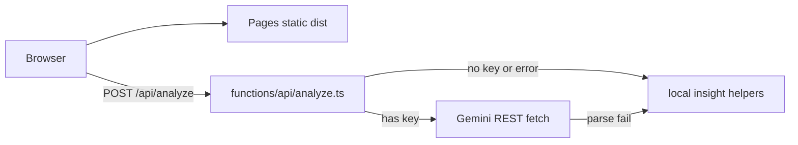

# Finance+ → Cloudflare Pages Implementation Plan

> **For agentic workers:** REQUIRED SUB-SKILL: Use superpowers:executing-plans (or subagent-driven-development) to implement this plan task-by-task. Steps use checkbox (`- [ ]`) syntax for tracking. At each phase gate and before any completion claim: REQUIRED SUB-SKILL superpowers:verification-before-completion.

**Goal:** Deploy Finance+ on Cloudflare Pages (`finance-plus`) with fast static loads and a Pages Function for `/api/analyze`, without touching Via Ditalia (`viaditalia`).

**Architecture:** Vite builds a static SPA into `dist/`. Cloudflare Pages serves those assets (unlimited static requests). Only `/api/*` invokes a Pages Function (`functions/api/analyze.ts`) that reads `GEMINI_API_KEY` from env/secrets, calls Gemini via HTTPS `fetch` (Workers-safe), and falls back to local Spanish insights if the key is missing or Gemini fails. Shared pure logic lives in `src/utils/analyzeInsight.ts` so Express local-dev and the Function stay in sync. `_routes.json` limits Function invocations to `/api/*` so Via Ditalia and Finance+ static traffic do not burn the Workers free quota.

**Tech Stack:** Vite 6 + React 19, Cloudflare Pages + Pages Functions, Wrangler v4, Vitest, Gemini REST (`generativelanguage.googleapis.com`).

## Global Constraints

- Project name Pages: `finance-plus` (never `viaditalia`).
- Do not edit, rebuild, or redeploy anything under `Pagina Via Ditalia/`.
- Do not push to GitHub until the user verifies on localhost and/or the Pages preview URL.
- Secrets: `wrangler pages secret put` / `.dev.vars` — never commit keys; never put `GEMINI_API_KEY` in `wrangler.jsonc` `vars`.
- Workers best practices: `wrangler.jsonc`, recent `compatibility_date`, `nodejs_compat` only if a dep requires it (this plan uses `fetch` for Gemini so prefer **no Node SDK in the Function**), no hand-written binding Env beyond documenting the secret string on `env`, structured errors with try/catch.
- Keep `npm run dev` (Express + Vite middleware) working for day-to-day local UI work; production path is Pages only.
- `render.yaml` stays as deprecated rollback docs until user confirms CF; production deploy script becomes `deploy:cloudflare`.



## File map

| File | Role |
|------|------|
| [`src/utils/analyzeInsight.ts`](Prototipo%202/finance+/src/utils/analyzeInsight.ts) | **Create** — pure fallback + prompt + response parse |
| [`src/utils/analyzeInsight.test.ts`](Prototipo%202/finance+/src/utils/analyzeInsight.test.ts) | **Create** — Vitest for fallback/empty/parse |
| [`functions/api/analyze.ts`](Prototipo%202/finance+/functions/api/analyze.ts) | **Create** — Pages Function POST handler |
| [`public/_routes.json`](Prototipo%202/finance+/public/_routes.json) | **Create** — only `/api/*` hits Functions |
| [`public/_redirects`](Prototipo%202/finance+/public/_redirects) | **Create** — SPA fallback `/* /index.html 200` |
| [`wrangler.jsonc`](Prototipo%202/finance+/wrangler.jsonc) | **Create** — Pages project config |
| [`package.json`](Prototipo%202/finance+/package.json) | **Modify** — build/deploy scripts + wrangler |
| [`server.ts`](Prototipo%202/finance+/server.ts) | **Modify** — thin wrapper over shared analyze helpers |
| [`.gitignore`](Prototipo%202/finance+/.gitignore) | **Modify** — `.wrangler/`, `.dev.vars` |
| [`render.yaml`](Prototipo%202/finance+/render.yaml) | **Modify** — mark DEPRECATED at top |
| [`handoff.md`](Prototipo%202/finance+/handoff.md) | **Modify last** — CF deploy docs (after verification) |

---

### Task 1: Extract and test analyze insight helpers (TDD)

**Files:**
- Create: `Prototipo 2/finance+/src/utils/analyzeInsight.ts`
- Create: `Prototipo 2/finance+/src/utils/analyzeInsight.test.ts`
- Consumes: logic currently inline in [`server.ts`](Prototipo%202/finance+/server.ts) lines 36–136
- Produces:
  - `export type AnalyzeRequestBody = { expenses?: Array<{ name?: string; category?: string; amount?: number; description?: string }>; budget?: number; income?: number; period?: string }`
  - `export type AnalyzeResponse = { insight: string; savingGoal: string }`
  - `export function buildAnalyzeResponse(body: AnalyzeRequestBody): AnalyzeResponse` — empty expenses + local fallbacks (no network)
  - `export function buildGeminiPrompt(body: AnalyzeRequestBody, meta: { totalSpent: number; topCategory: string; topCategoryPercent: number }): string`
  - `export function parseGeminiInsightText(responseText: string, topCategory: string): AnalyzeResponse | null`

- [ ] **Step 1: Write failing tests** in `src/utils/analyzeInsight.test.ts`:

```ts
import { describe, it, expect } from "vitest";
import {
  buildAnalyzeResponse,
  parseGeminiInsightText,
} from "./analyzeInsight";

describe("buildAnalyzeResponse", () => {
  it("returns onboarding copy when expenses empty", () => {
    const r = buildAnalyzeResponse({ expenses: [] });
    expect(r.insight).toMatch(/Comienza agregando/);
    expect(r.savingGoal).toBeTruthy();
  });

  it("returns budget alert when spend exceeds 90% of budget", () => {
    const r = buildAnalyzeResponse({
      budget: 100,
      expenses: [{ name: "X", category: "Alimentación", amount: 95 }],
    });
    expect(r.insight).toMatch(/Alerta de Presupuesto/);
  });
});

describe("parseGeminiInsightText", () => {
  it("parses JSON insight field", () => {
    const r = parseGeminiInsightText(
      JSON.stringify({ insight: "Ahorra en transporte." }),
      "Transporte"
    );
    expect(r?.insight).toBe("Ahorra en transporte.");
    expect(r?.savingGoal).toMatch(/transporte/i);
  });

  it("returns null on empty string", () => {
    expect(parseGeminiInsightText("", "Otros")).toBeNull();
  });
});
```

- [ ] **Step 2: Run tests — expect FAIL**

```bash
cd "Prototipo 2/finance+" && npm test -- src/utils/analyzeInsight.test.ts
```

Expected: FAIL (module/export missing).

- [ ] **Step 3: Implement `analyzeInsight.ts`** by moving the Spanish fallback maps, totals, budget-ratio branches, prompt builder, and JSON parse logic from `server.ts` into the exports above. No Gemini network calls in this module.

- [ ] **Step 4: Run tests — expect PASS**

```bash
npm test -- src/utils/analyzeInsight.test.ts
```

- [ ] **Step 5: Commit** (local only)

```bash
git add src/utils/analyzeInsight.ts src/utils/analyzeInsight.test.ts
git commit -m "refactor: extract analyze insight helpers for Pages Function"
```

---

### Task 2: Thin Express server + Gemini REST helper

**Files:**
- Modify: `Prototipo 2/finance+/server.ts`
- Create: `Prototipo 2/finance+/src/utils/callGeminiInsight.ts`
- Interfaces:
  - Consumes: `buildAnalyzeResponse`, `buildGeminiPrompt`, `parseGeminiInsightText`
  - Produces: `export async function callGeminiInsight(apiKey: string, prompt: string): Promise<string | null>` using:

```ts
const url =
  `https://generativelanguage.googleapis.com/v1beta/models/gemini-2.0-flash:generateContent?key=${encodeURIComponent(apiKey)}`;
// POST JSON { contents: [{ parts: [{ text: prompt }] }], generationConfig: { responseMimeType: "application/json" } }
// return candidates[0].content.parts[0].text or null on failure
```

- [ ] **Step 1: Add `callGeminiInsight.ts`** (fetch-only; no `@google/genai` in this helper).

- [ ] **Step 2: Rewrite `/api/analyze` in `server.ts`** to:
  1. Parse body → `buildAnalyzeResponse` for empty/local baseline meta.
  2. If `GEMINI_API_KEY` valid, `callGeminiInsight` + `parseGeminiInsightText`; on success return that; else return local `buildAnalyzeResponse` result.
  3. Keep Vite middleware / static `dist` behavior for local `npm run dev` / optional `npm start`.

- [ ] **Step 3: Verify local API still works**

```bash
npm run lint
npm test
# with server running: curl -s -X POST http://localhost:3000/api/analyze -H 'Content-Type: application/json' -d '{"expenses":[{"name":"Café","category":"Alimentación","amount":50}],"budget":1000}'
```

Expected: JSON `{ insight, savingGoal }`.

- [ ] **Step 4: Commit**

```bash
git add server.ts src/utils/callGeminiInsight.ts
git commit -m "refactor: share Gemini fetch helper between Express and Pages"
```

---

### Task 3: Pages Function + SPA routes

**Files:**
- Create: `Prototipo 2/finance+/functions/api/analyze.ts`
- Create: `Prototipo 2/finance+/public/_routes.json`
- Create: `Prototipo 2/finance+/public/_redirects`

`public/_routes.json`:

```json
{
  "version": 1,
  "include": ["/api/*"],
  "exclude": []
}
```

`public/_redirects`:

```
/*    /index.html   200
```

`functions/api/analyze.ts`:

```ts
import {
  buildAnalyzeResponse,
  buildGeminiPrompt,
  parseGeminiInsightText,
  type AnalyzeRequestBody,
} from "../../src/utils/analyzeInsight";
import { callGeminiInsight } from "../../src/utils/callGeminiInsight";

type Env = { GEMINI_API_KEY?: string };

export const onRequestPost: PagesFunction<Env> = async (context) => {
  try {
    const body = (await context.request.json()) as AnalyzeRequestBody;
    const local = buildAnalyzeResponse(body);
    const key = context.env.GEMINI_API_KEY;
    if (!key || key === "MY_GEMINI_API_KEY") {
      return Response.json(local);
    }
    // Recompute meta for prompt the same way buildAnalyzeResponse does —
    // either export getAnalyzeMeta(body) from analyzeInsight or rebuild prompt inputs there.
    const prompt = /* from exported helper */;
    const text = await callGeminiInsight(key, prompt);
    if (text) {
      const parsed = parseGeminiInsightText(text, /* topCategory */);
      if (parsed) return Response.json(parsed);
    }
    return Response.json(local);
  } catch (err) {
    console.error("analyze failed", err);
    return Response.json(
      { insight: "No pudimos analizar ahora. Intenta de nuevo.", savingGoal: "Revisa tus gastos del mes" },
      { status: 200 }
    );
  }
};

export const onRequest: PagesFunction = async (context) => {
  if (context.request.method === "OPTIONS") {
    return new Response(null, {
      headers: {
        "Access-Control-Allow-Origin": "*",
        "Access-Control-Allow-Methods": "POST, OPTIONS",
        "Access-Control-Allow-Headers": "Content-Type",
      },
    });
  }
  return context.next();
};
```

During implementation, export `getAnalyzeMeta(body)` from Task 1 so the Function does not duplicate category math. Prefer a single `export async function resolveAnalyze(body, apiKey?: string): Promise<AnalyzeResponse>` in `analyzeInsight.ts` / thin orchestrator used by both Express and the Function — if that keeps the plan DRY, implement that instead of duplicating the Gemini branch.

- [ ] **Step 1: Add `_routes.json` and `_redirects` under `public/`** (Vite copies them into `dist/`).

- [ ] **Step 2: Add Function** importing shared helpers (path relative from `functions/api/`).

- [ ] **Step 3: Prefer one orchestrator** `resolveAnalyze(body, apiKey?)` so Express and Function share the Gemini branch (update Task 2 server to call it).

- [ ] **Step 4: Commit**

```bash
git add functions public/_routes.json public/_redirects src/utils
git commit -m "feat: add Pages Function for /api/analyze"
```

---

### Task 4: Wrangler + package.json + deprecate Render

**Files:**
- Create: `Prototipo 2/finance+/wrangler.jsonc`
- Modify: `Prototipo 2/finance+/package.json`
- Modify: `Prototipo 2/finance+/render.yaml`
- Modify: `Prototipo 2/finance+/.gitignore`

`wrangler.jsonc`:

```jsonc
{
  "$schema": "./node_modules/wrangler/config-schema.json",
  "name": "finance-plus",
  "compatibility_date": "2026-07-16",
  "pages_build_output_dir": "dist",
  "observability": { "enabled": true }
}
```

No `nodejs_compat` unless Function bundling fails without it (fetch-only path should not need it).

`package.json` scripts (concrete):

```json
"build": "vite build",
"build:node": "vite build && esbuild server.ts --bundle --platform=node --format=cjs --packages=external --sourcemap --outfile=dist/server.cjs",
"start": "NODE_ENV=production node dist/server.cjs",
"deploy:cloudflare": "npm run build && npx wrangler pages deploy dist --project-name=finance-plus",
"preview:cf": "npm run build && npx wrangler pages dev dist"
```

- Add `wrangler` as `devDependency` (`wrangler@latest`, v4+).
- Keep `dev`: `tsx server.ts`.
- `build` becomes Vite-only (CF production). `build:node` preserves Render rollback.

`render.yaml`: first lines comment that production is Cloudflare Pages; file kept only for emergency rollback.

`.gitignore` add:

```
.wrangler/
.dev.vars
```

Via Ditalia pattern to copy (script only, different project name):

```json
"deploy:cloudflare": "npm run build && npx wrangler pages deploy out --project-name=viaditalia"
```

→ Finance+: `dist` + `--project-name=finance-plus`.

- [ ] **Step 1: Add wrangler + scripts + wrangler.jsonc + gitignore**

- [ ] **Step 2: `npm run build` — expect `dist/` with `index.html`, `_routes.json`, `_redirects`**

- [ ] **Step 3: Commit**

```bash
git add package.json package-lock.json wrangler.jsonc render.yaml .gitignore
git commit -m "chore: configure Cloudflare Pages deploy for finance-plus"
```

---

### Task 5: Local CF preview + secret setup + first deploy

**Do not push.** Do not run any command against project `viaditalia`.

- [ ] **Step 1: Auth check**

```bash
npx wrangler whoami
```

If not logged in: `npx wrangler login` (user interactive).

- [ ] **Step 2: Local Pages preview**

```bash
npm run preview:cf
```

Then:

```bash
curl -s -X POST http://127.0.0.1:8788/api/analyze \
  -H 'Content-Type: application/json' \
  -d '{"expenses":[{"name":"Café","category":"Alimentación","amount":50}],"budget":1000}'
```

Expected: JSON insight (local fallback without `.dev.vars`).

Optional `.dev.vars` (gitignored):

```
GEMINI_API_KEY=your_key_here
```

- [ ] **Step 3: Verification gate (verification-before-completion)**

Run fresh and record exit codes:

```bash
npm test
npm run lint
npm run build
```

All must pass before deploy.

- [ ] **Step 4: First deploy (new Pages project)**

```bash
npm run deploy:cloudflare
```

Expected: creates/updates project `finance-plus` → URL like `https://finance-plus.pages.dev`. Confirm dashboard shows **two** projects: `viaditalia` and `finance-plus`; Via Ditalia URL unchanged.

- [ ] **Step 5: Set production secret**

```bash
npx wrangler pages secret put GEMINI_API_KEY --project-name=finance-plus
```

Redeploy if needed so the Function sees the secret.

- [ ] **Step 6: Smoke-test production**

Open `https://finance-plus.pages.dev`, confirm app loads quickly (no Render cold start), wallets/localStorage work, AI refresh hits `/api/analyze`.

- [ ] **Step 7: Commit any fixups from preview (still no push)**

---

### Task 6: Update handoff.md (after user OK)

**Files:** Modify [`Prototipo 2/finance+/handoff.md`](Prototipo%202/finance+/handoff.md)

- [ ] **Step 1: Update Deploy section** to Cloudflare Pages primary:
  - Project: `finance-plus`
  - Commands: `npm run deploy:cloudflare`, `wrangler pages secret put GEMINI_API_KEY`
  - Note: same CF account as Via Ditalia; projects isolated; `_routes.json` limits Function usage
  - Render: deprecated rollback via `build:node` + `render.yaml`
- [ ] **Step 2: Commit handoff** when user asks / after verify
- [ ] **Step 3: Push only when user explicitly says so**

---

## Verification checklist (gate before claiming done)

| Check | Command / action | Pass criteria |
|-------|------------------|---------------|
| Unit tests | `npm test` | 0 failures (wallet + analyzeInsight) |
| Types | `npm run lint` | exit 0 |
| Static build | `npm run build` | `dist/index.html` + `_routes.json` |
| CF local API | `npm run preview:cf` + curl `/api/analyze` | 200 JSON |
| Pages project | Dashboard | `finance-plus` exists; `viaditalia` untouched |
| Cold start | Open Pages URL after idle | loads in seconds, not ~60s |
| No push | `git status` | commits local until user approves |

## Self-review (spec coverage)

1. Static SPA on new Pages project — Tasks 3–5  
2. `/api/analyze` Function + secret + fallback — Tasks 1–3, 5  
3. package.json / wrangler / render.yaml — Task 4  
4. Via Ditalia pattern reuse, no mix — Task 4–5 (`finance-plus` only)  
5. Local + deploy verify, no push — Task 5  
6. handoff.md later — Task 6  

## Execution handoff

**Plan complete.** After you approve this plan:

1. Switch to Agent mode and run with **/executing-plans** (inline, task-by-task with checkpoints). Prefer **/subagent-driven-development** if you want a fresh subagent per task.
2. At every phase gate and before any “done” / deploy-success claim, use **/verification-before-completion** (fresh `npm test`, `npm run lint`, `npm run build`, plus curl/preview evidence).
3. Do **not** push until you verify localhost / `finance-plus.pages.dev`.
4. Update `handoff.md` only after that verification (Task 6).
