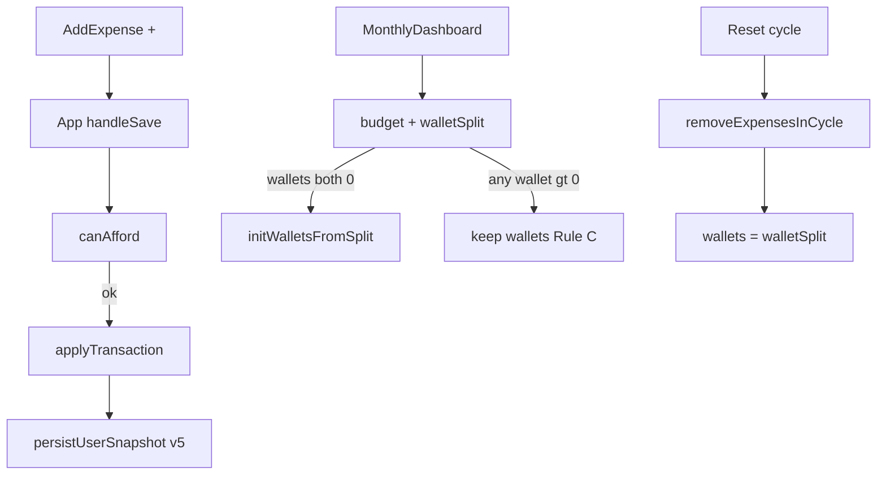

# Transactions, Wallets e Ingresos — Implementation Plan

> **For agentic workers:** REQUIRED SUB-SKILL: Use superpowers:executing-plans (user preference) with superpowers:test-driven-development in Phase 1 and superpowers:verification-before-completion at each phase gate. Steps use checkbox (`- [ ]`) syntax for tracking.

**Goal:** Implementar saldos tarjeta/efectivo, ingresos desde "+", y detalle/edición en Semanal en tres fases usables y persistibles, sin reabrir decisiones del spec.

**Architecture:** Extender `Expense` con `type: "gasto" | "ingreso"` (alias mental: Transaction). Persistir `wallets` + `walletSplit` en `UserSnapshot` (storage v5). Toda mutación de saldo pasa por helpers puros en `utils/wallet.ts` (`canAfford`, `applyTransaction`, `revertTransaction`, `initWalletsFromSplit`, `isValidSplit`). UI cableada desde `App.tsx`.

**Tech Stack:** React 19, TypeScript, Vite, localStorage; **Vitest** (nuevo) para TDD de helpers.

**Canonical plan path (on approval, copy/save to):** [docs/superpowers/plans/2026-07-16-transactions-wallets-income.md](Prototipo%202/finance+/docs/superpowers/plans/2026-07-16-transactions-wallets-income.md)

**Spec (do not edit):** [docs/superpowers/specs/2026-07-16-transactions-wallets-income-design.md](Prototipo%202/finance+/docs/superpowers/specs/2026-07-16-transactions-wallets-income-design.md)

## Global Constraints

- Un solo tipo de movimiento: `type: "gasto" | "ingreso"` + `wallets` persistidos
- Presupuesto puede ir negativo; tarjeta/efectivo no (bloquear si no alcanza)
- Regla C: editar ingreso/presupuesto a mitad de mes actualiza `budget` + `walletSplit`, **no** reaplica `wallets` si ya hay saldo
- Reiniciar ciclo: borra movimientos del ciclo **y** `wallets = initWalletsFromSplit(walletSplit)`
- Detalle/editar solo desde Semanal (Fase 3)
- Migración v4 → v5: si faltan, `walletSplit = { tarjeta: 0, efectivo: budget.income }` y `wallets` igual
- Legacy sin `type` → gasto; sin `paymentMethod` → efectivo
- Cada fase usable y persistible sola; commit al cerrar cada tarea/fase
- No push a GitHub hasta verificación local del usuario
- No editar el archivo del spec

## File map

| File | Role |
|------|------|
| Create `src/utils/wallet.ts` | Lógica pura de saldos |
| Create `src/utils/wallet.test.ts` | Tests TDD |
| Modify `src/types.ts` | `Wallets`, `WalletSplit`, `type` en Expense, export payload |
| Modify `src/utils/storage.ts` | v5, snapshot fields, migración, `createSnapshot` |
| Modify `src/mockData.ts` | `DEMO_WALLETS` / `DEMO_WALLET_SPLIT`, `type: "gasto"` en demos |
| Modify `src/App.tsx` | Estado wallets/split; save/delete/reset con wallet helpers |
| Modify `src/components/MonthlyDashboard.tsx` | UI saldos + reparto en modal (regla C) |
| Modify `src/components/AddExpense.tsx` | Fase 1: bloquear gasto; Fase 2: toggle ingreso |
| Modify `src/components/WeeklyTracking.tsx` | Fase 2: lista mixta; Fase 3: tap → detalle |
| Modify `src/utils/exportMonthlyData.ts` | Incluir wallets/split; totales solo gastos |
| Modify `src/utils/resetCycleData.ts` | Sin cambio de firma; App rellena wallets tras filtrar |
| Create `src/components/TransactionDetailModal.tsx` | Fase 3 |
| Modify `package.json` | Scripts + vitest |



---

## Phase 1 — Saldos (usable sola)

### Task 1: Add Vitest

**Files:** Modify `package.json`; optionally `vitest.config.ts`

- [ ] **Step 1:** Add devDependency `vitest` and script `"test": "vitest run"`, `"test:watch": "vitest"`
- [ ] **Step 2:** Run `npm install` then `npm test` — expect 0 tests / exit 0 or “no tests”
- [ ] **Step 3:** Commit: `Agregar Vitest para TDD de wallets.`

### Task 2: Types `Wallets` / `WalletSplit` + `Expense.type`

**Files:** Modify [src/types.ts](Prototipo%202/finance+/src/types.ts)

**Produces:**
```ts
export type TransactionType = "gasto" | "ingreso";
export interface Wallets { tarjeta: number; efectivo: number; }
export interface WalletSplit { tarjeta: number; efectivo: number; }
// Expense: add type?: TransactionType  (default treat as gasto)
// MonthlyExportPayload: add wallets, walletSplit
```

- [ ] Add types as above
- [ ] Commit: `Agregar tipos Wallets, WalletSplit y type en Expense.`

### Task 3: TDD — `utils/wallet.ts` (RED → GREEN)

**Files:**
- Create `src/utils/wallet.test.ts`
- Create `src/utils/wallet.ts`

**Interfaces to implement:**
```ts
export function getPaymentMethod(tx: Pick<Expense, "paymentMethod">): PaymentMethod
export function getTransactionType(tx: Pick<Expense, "type">): TransactionType
export function isValidSplit(split: WalletSplit, income: number): boolean
export function initWalletsFromSplit(split: WalletSplit): Wallets
export function canAfford(wallets: Wallets, method: PaymentMethod, amount: number): boolean
export function applyTransaction(wallets: Wallets, tx: Pick<Expense, "type" | "amount" | "paymentMethod">): Wallets | null
export function revertTransaction(wallets: Wallets, tx: Pick<Expense, "type" | "amount" | "paymentMethod">): Wallets | null
```

**Semantics (lock):**
- `getTransactionType`: missing → `"gasto"`
- `getPaymentMethod`: missing → `"efectivo"`
- `isValidSplit`: both ≥ 0 and `tarjeta + efectivo === income` (tolerance 0.01 for floats)
- `applyTransaction` gasto: if `!canAfford` return `null`; else subtract from method
- `applyTransaction` ingreso: add to method (always ok)
- `revertTransaction` gasto: add back to method
- `revertTransaction` ingreso: if resulting method would be &lt; 0 return `null`; else subtract
- Never produce negative balances in successful returns

- [ ] **RED:** Write tests covering: canAfford true/false; apply gasto ok/fail; apply ingreso; revert gasto; revert ingreso ok/fail; isValidSplit; initWalletsFromSplit; legacy defaults
- [ ] Run `npm test` — FAIL (module missing)
- [ ] **GREEN:** Implement minimal `wallet.ts`
- [ ] Run `npm test` — PASS
- [ ] Commit: `Agregar helpers de wallets con tests TDD.`

### Task 4: Storage v5 + migración

**Files:** Modify [src/utils/storage.ts](Prototipo%202/finance+/src/utils/storage.ts), [src/mockData.ts](Prototipo%202/finance+/src/mockData.ts)

**Produces:**
```ts
UserSnapshot { /* existing */, wallets: Wallets; walletSplit: WalletSplit; }
STORAGE_VERSION = "5"
createSnapshot(..., wallets, walletSplit)
```

**Migration helpers (in storage or wallet):**
```ts
function defaultSplitFromIncome(income: number): WalletSplit {
  return { tarjeta: 0, efectivo: income };
}
```

- [ ] Extend `UserSnapshot`, `getDemoSnapshot`, `getEmptySnapshot`, `loadUserSnapshot`, `saveUserSnapshot`, `createSnapshot`
- [ ] On load: if wallets/split missing → derive from `budget.income` as above
- [ ] Demo: `DEMO_WALLET_SPLIT = { tarjeta: 0, efectivo: 3200 }`, `DEMO_WALLETS` same; subtract demo expense amounts from wallets so demo balances are coherent OR set wallets to post-expense balances (document in commit). Preferred: set split from income, then `wallets = apply each DEMO_EXPENSE as gasto` in mock factory so demo saldos match listed gastos
- [ ] Commit: `Persistir wallets y walletSplit en storage v5.`

### Task 5: Wire App — estado, save gasto, delete gasto, reset

**Files:** Modify [src/App.tsx](Prototipo%202/finance+/src/App.tsx)

**Consumes:** wallet helpers + extended snapshot

- [ ] State: `wallets`, `walletSplit` from `initialAppData.snapshot`
- [ ] `useEffect` persist: include wallets/split in `createSnapshot`
- [ ] `applySnapshot`: set wallets/split
- [ ] `handleSaveExpense`: build expense with `type: "gasto"`; `const next = applyTransaction(wallets, expense)`; if `null`, return error string to UI (callback result or toast via return value). Preferred API:
  ```ts
  handleSaveExpense(...): { ok: true } | { ok: false; error: string }
  ```
- [ ] `handleDeleteExpense`: find tx; `revertTransaction`; if `null` block delete (toast/alert); else update wallets + remove
- [ ] `handleResetCycleExpenses`: filter cycle; `setWallets(initWalletsFromSplit(walletSplit))`
- [ ] `handleUpdateBudgetConfig({ budget, walletSplit })`: always set budget + split; **only if** `wallets.tarjeta === 0 && wallets.efectivo === 0` then `setWallets(initWalletsFromSplit(walletSplit))` (primera vez / vacío); else keep wallets (regla C)
- [ ] Commit: `Conectar wallets en App para guardar, borrar y reiniciar.`

### Task 6: MonthlyDashboard — saldos + reparto

**Files:** Modify [src/components/MonthlyDashboard.tsx](Prototipo%202/finance+/src/components/MonthlyDashboard.tsx)

**Props add:**
```ts
wallets: Wallets;
walletSplit: WalletSplit;
onUpdateBudgetConfig?: (payload: { budget: MonthlyBudget; walletSplit: WalletSplit }) => void;
onUpdateWallets?: (wallets: Wallets) => void;
```

- [ ] Under Ingresos/Gastos grid: rows Tarjeta / Efectivo with amounts; tap opens small edit (≥ 0) calling `onUpdateWallets`
- [ ] Budget modal: fields tarjeta + efectivo; validate `isValidSplit` before save; hint: “Este reparto se usa al iniciar (saldos en 0) o al reiniciar el ciclo.”
- [ ] Replace `onUpdateBudget` with `onUpdateBudgetConfig` (or keep both; prefer single config callback)
- [ ] Pass props from App
- [ ] Manual verify: `npm run lint`
- [ ] Commit: `Mostrar y editar saldos tarjeta/efectivo en Inicio.`

### Task 7: AddExpense — bloquear gasto sin saldo

**Files:** Modify [src/components/AddExpense.tsx](Prototipo%202/finance+/src/components/AddExpense.tsx)

- [ ] Props: `wallets: Wallets`; `onSaveExpense` returns `{ ok, error? }`
- [ ] Before save: if `!canAfford(wallets, paymentMethod, amount)` show toast “No tienes suficiente saldo en {efectivo|tarjeta}.” and do not call save
- [ ] If save returns `ok: false`, show error
- [ ] Commit: `Bloquear gastos que excedan el saldo del método.`

### Task 8: Export includes wallets (phase 1 baseline)

**Files:** Modify [src/utils/exportMonthlyData.ts](Prototipo%202/finance+/src/utils/exportMonthlyData.ts), [src/types.ts](Prototipo%202/finance+/src/types.ts) if needed

- [ ] Accept `wallets` + `walletSplit` in input; attach to payload
- [ ] Wire from AnalysisDetailed / App export call sites
- [ ] Commit: `Incluir wallets en export JSON.`

### Phase 1 gate (verification-before-completion)

- [ ] Run `npm test` — all wallet tests pass
- [ ] Run `npm run lint` — clean
- [ ] Run `npm run dev` — manual checklist:
  1. Mis datos: configurar ingreso + reparto → saldos se llenan (si estaban en 0)
  2. Gasto resta método; bloquea si no alcanza
  3. Presupuesto puede ir negativo tras muchos gastos (si wallets alcanzan)
  4. Ajuste manual ≥ 0
  5. Editar ingreso con saldos ya &gt; 0: split cambia, wallets no
  6. Reiniciar ciclo: movimientos del ciclo fuera; wallets = split
- [ ] **Do not push** until user OK
- [ ] Mark phase 1 complete in plan checkboxes

---

## Phase 2 — Ingresos en "+"

### Task 9: AddExpense toggle Gasto | Ingreso

**Files:** Modify [src/components/AddExpense.tsx](Prototipo%202/finance+/src/components/AddExpense.tsx)

- [ ] State `entryType: TransactionType` toggle UI
- [ ] Ingreso form: amount, paymentMethod (destino), name optional (default `"Ingreso"`), description optional; week = `activeWeek`; no category required (save `category: "Ingreso"` or `""` — use `"Ingreso"` for list display stability)
- [ ] Submit ingreso: `type: "ingreso"`; App `applyTransaction` adds to wallet; **must not** change `budget`
- [ ] Hero copy changes: “Añadir Gasto” / “Añadir Ingreso”
- [ ] Commit: `Permitir registrar ingresos desde el tab +.`

### Task 10: WeeklyTracking — lista mixta + totales solo gastos

**Files:** Modify [src/components/WeeklyTracking.tsx](Prototipo%202/finance+/src/components/WeeklyTracking.tsx)

- [ ] Helper inline: `isExpense = getTransactionType(e) === "gasto"`
- [ ] `calculateWeekSpent` / category totals / budget bars: **only gastos**
- [ ] List shows all week txs: gasto `-$` current style; ingreso `+$` in `#4edea3`, icon `savings`
- [ ] Delete: use App handler (already reverts); show toast if blocked
- [ ] Commit: `Mostrar ingresos en Semanal sin afectar totales de gasto.`

### Task 11: Analysis / export filter gastos for totals

**Files:** Modify [src/components/AnalysisDetailed.tsx](Prototipo%202/finance+/src/components/AnalysisDetailed.tsx), [src/utils/exportMonthlyData.ts](Prototipo%202/finance+/src/utils/exportMonthlyData.ts), [src/components/MonthlyDashboard.tsx](Prototipo%202/finance+/src/components/MonthlyDashboard.tsx)

- [ ] Anywhere `totalExpenses` / remaining budget / category donut: exclude `type === "ingreso"`
- [ ] Export `totalExpenses` / byCategory: only gastos; still list all transactions in `expenses` array (or rename field later — keep array name, include ingresos with `type`)
- [ ] Commit: `Excluir ingresos de totales de presupuesto y categorías.`

### Phase 2 gate

- [ ] `npm test` + `npm run lint`
- [ ] Manual: ingreso suma wallet, no cambia Ingresos del mes; aparece `+$` en Semanal; totales semanales ignoran ingresos
- [ ] User OK before push

---

## Phase 3 — Detalle / editar (solo Semanal)

### Task 12: TDD — edit path via revert + apply

**Files:** Extend `src/utils/wallet.test.ts` (no new module required)

```ts
export function applyEdit(
  wallets: Wallets,
  before: Pick<Expense, "type" | "amount" | "paymentMethod">,
  after: Pick<Expense, "type" | "amount" | "paymentMethod">
): Wallets | null {
  const reverted = revertTransaction(wallets, before);
  if (!reverted) return null;
  return applyTransaction(reverted, after);
}
```

- [ ] RED tests: change amount, change method, fail when insufficient
- [ ] GREEN implement `applyEdit` in `wallet.ts`
- [ ] Commit: `Agregar applyEdit para editar movimientos con saldos.`

### Task 13: TransactionDetailModal

**Files:** Create `src/components/TransactionDetailModal.tsx`

- [ ] Props: `transaction`, `wallets`, `onClose`, `onSave(updated)`, `onDelete?(id)`
- [ ] View mode: large amount, name, category (if gasto), method, date, description, week, status
- [ ] Edit mode: editable fields by type; Save calls parent; Cancel resets
- [ ] Do not allow changing `type` gasto ↔ ingreso
- [ ] Commit: `Agregar modal de detalle y edición de transacciones.`

### Task 14: Wire Semanal tap + App update handler

**Files:** Modify [src/components/WeeklyTracking.tsx](Prototipo%202/finance+/src/components/WeeklyTracking.tsx), [src/App.tsx](Prototipo%202/finance+/src/App.tsx)

- [ ] Tap row (not delete, not “ver más”) opens modal
- [ ] `handleUpdateExpense(updated)`: `applyEdit`; if null toast and abort; else replace in list + setWallets
- [ ] Delete from modal optional; same as list delete
- [ ] Commit: `Permitir editar transacciones desde Semanal.`

### Phase 3 gate + final

- [ ] `npm test` + `npm run lint` + `npm run build`
- [ ] Manual acceptance criteria 11–14 from spec
- [ ] User verifies localhost; then push/deploy only if asked

---

## Spec coverage checklist

- Fase 1 saldos / bloqueo / ajuste / reset refill → Tasks 3–8
- Regla C → Task 5 `handleUpdateBudgetConfig`
- Migración v5 → Task 4
- Fase 2 ingresos + lista → Tasks 9–11
- Fase 3 detalle/editar → Tasks 12–14
- Fuera de alcance respetado (no Resumen detail, no transfer, no type flip)

## Execution note

User will run this with **/executing-plans** (Composer 2.5), **/test-driven-development** for Phase 1 wallet work, and **/verification-before-completion** at each phase gate. After plan approval, save this document to `docs/superpowers/plans/2026-07-16-transactions-wallets-income.md` before coding.
